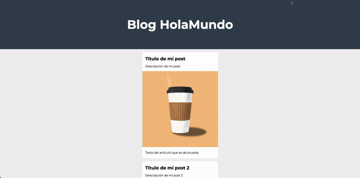

# Proyecto del canal de HolaMundo (Youtube)

    (https://www.youtube.com/@HolaMundoDev/featured).

Todo lo necesario se encuentra en lo siguiente:

En este proyecto empezamos a relizar una página web desde cero utilizando HTML.  
 (https://www.youtube.com/watch?v=MJkdaVFHrto&ab_channel=HolaMundo)

Y se continua con el proyecto ahora dando el diseño con CSS.
(https://www.youtube.com/watch?v=wZniZEbPAzk&ab_channel=HolaMundo)

## Resultado.

En estos pequeños tutoriales se plantean las funciones básicas para el desarrollo de una web.
Son exelentes para iniciar en el mundo Frontend.
